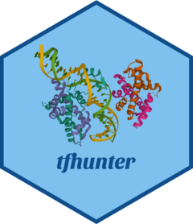

<!-- README.md is generated from README.Rmd. Please edit that file -->

```{r, include = FALSE}
knitr::opts_chunk$set(
    collapse = TRUE,
    comment = "#>",
    fig.path = "man/figures/README-",
    out.width = "100%"
)
```

# tfhunter 

<!-- badges: start -->
[](https://github.com/almeidasilvaf/tfhunter/issues)
[](https://lifecycle.r-lib.org/articles/stages.html#stable)
[](https://github.com/almeidasilvaf/tfhunter/actions)
[](https://codecov.io/gh/almeidasilvaf/tfhunter?branch=master)
<!-- badges: end -->

The goal of `tfhunter` is to identify plant transcription factors from protein 
sequence data and classify them into families and subfamilies using the
classification scheme implemented 
in [PlantTFDB](https://doi.org/10.1093/nar/gkz1020).

## Installation instructions

Get the latest stable `R` release from [CRAN](http://cran.r-project.org/). 
Then install `tfhunter` from [Bioconductor](http://bioconductor.org/) 
using the following code:

```{r 'install', eval = FALSE}
if (!requireNamespace("BiocManager", quietly = TRUE)) {
    install.packages("BiocManager")
}

BiocManager::install("tfhunter")
```

And the development version from 
[GitHub](https://github.com/almeidasilvaf/tfhunter) with:

```{r 'install_dev', eval = FALSE}
BiocManager::install("almeidasilvaf/tfhunter")
```

## Citation

Below is the citation output from using `citation('tfhunter')` in R. Please
run this yourself to check for any updates on how to cite __tfhunter__.

```{r 'citation', eval = requireNamespace('tfhunter')}
print(citation('tfhunter'), bibtex = TRUE)
```

Please note that the `tfhunter` project was only made possible thanks to many 
other R and bioinformatics software authors, which are cited either in the 
vignettes and/or the paper(s) describing this package.

## Code of Conduct

Please note that the `tfhunter` project is released with a [Contributor Code of Conduct](http://bioconductor.org/about/code-of-conduct/). By contributing to this project, you agree to abide by its terms.

## Development tools

* Continuous code testing is possible thanks to [GitHub actions](https://www.tidyverse.org/blog/2020/04/usethis-1-6-0/)  through `r BiocStyle::CRANpkg('usethis')`, `r BiocStyle::CRANpkg('remotes')`, and `r BiocStyle::CRANpkg('rcmdcheck')` customized to use [Bioconductor's docker containers](https://www.bioconductor.org/help/docker/) and `r BiocStyle::Biocpkg('BiocCheck')`.
* Code coverage assessment is possible thanks to [codecov](https://codecov.io/gh) and `r BiocStyle::CRANpkg('covr')`.
* The [documentation website](http://almeidasilvaf.github.io/tfhunter) is automatically updated thanks to `r BiocStyle::CRANpkg('pkgdown')`.
* The documentation is formatted thanks to `r BiocStyle::CRANpkg('devtools')` and `r BiocStyle::CRANpkg('roxygen2')`.

For more details, check the `dev` directory.

This package was developed using `r BiocStyle::Biocpkg('biocthis')`.


