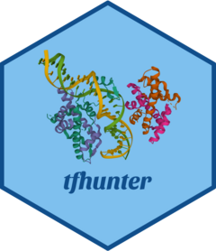

<!-- README.md is generated from README.Rmd. Please edit that file -->

# planttfhunter 

<!-- badges: start -->

[](https://github.com/almeidasilvaf/planttfhunter/issues)
[](https://lifecycle.r-lib.org/articles/stages.html#stable)
[](https://github.com/almeidasilvaf/planttfhunter/actions)
[](https://codecov.io/gh/almeidasilvaf/planttfhunter?branch=devel)
<!-- badges: end -->

The goal of **planttfhunter** is to identify plant transcription factors
from protein sequence data and classify them into families and
subfamilies using the classification schemes implemented in
[PlantTFDB](https://doi.org/10.1093/nar/gkw982) and
[TAPscan](https://doi.org/10.1111/tpj.17184), and into structure-based
families, classes, and superclasses as in
[Plant-TFClass](https://doi.org/10.1016/j.tplants.2023.06.023).

## Installation instructions

Get the latest stable `R` release from
[CRAN](http://cran.r-project.org/). Then install **planttfhunter** from
[Bioconductor](http://bioconductor.org/) using the following code:

``` r
if (!requireNamespace("BiocManager", quietly = TRUE)) {
    install.packages("BiocManager")
}

BiocManager::install("planttfhunter")
```

Or the development version from
[GitHub](https://github.com/almeidasilvaf/planttfhunter) with:

``` r
BiocManager::install("almeidasilvaf/planttfhunter")
```

## Citation

Below is the citation output from using `citation('planttfhunter')` in
R. Please run this yourself to check for any updates on how to cite
**planttfhunter**.

``` r
print(citation('planttfhunter'), bibtex = TRUE)
#> To cite planttfhunter in publications, please cite the package and the
#> classification scheme(s) you used:
#> 
#>   Almeida-Silva F, Van de Peer Y (2022). _planttfhunter: Identification
#>   and classification of plant transcription factors_.
#>   doi:10.18129/B9.bioc.planttfhunter
#>   <https://doi.org/10.18129/B9.bioc.planttfhunter>, R package version
#>   1.13.0, <https://bioconductor.org/packages/planttfhunter>.
#> 
#> A BibTeX entry for LaTeX users is
#> 
#>   @Manual{planttfhunter,
#>     title = {planttfhunter: Identification and classification of plant transcription factors},
#>     author = {Fabrício Almeida-Silva and Yves {Van de Peer}},
#>     year = {2022},
#>     note = {R package version 1.13.0},
#>     doi = {10.18129/B9.bioc.planttfhunter},
#>     url = {https://bioconductor.org/packages/planttfhunter},
#>   }
#> 
#> Jin J, Tian F, Yang D, Meng Y, Kong L, Luo J, Gao G (2017). "PlantTFDB
#> 4.0: toward a central hub for transcription factors and regulatory
#> interactions in plants." _Nucleic Acids Research_, *45*(D1),
#> D1040-D1045. doi:10.1093/nar/gkw982
#> <https://doi.org/10.1093/nar/gkw982>.
#> 
#> A BibTeX entry for LaTeX users is
#> 
#>   @Article{jin2017planttfdb,
#>     title = {PlantTFDB 4.0: toward a central hub for transcription factors and regulatory interactions in plants},
#>     author = {Jinpu Jin and Feng Tian and De-Chang Yang and Yu-Qi Meng and Lei Kong and Jingchu Luo and Ge Gao},
#>     journal = {Nucleic Acids Research},
#>     volume = {45},
#>     number = {D1},
#>     pages = {D1040--D1045},
#>     year = {2017},
#>     doi = {10.1093/nar/gkw982},
#>   }
#> 
#> Petroll R, Varshney D, Hiltemann S, Finke H, Schreiber M, de Vries J,
#> Rensing SA (2025). "Enhanced sensitivity of TAPscan v4 enables
#> comprehensive analysis of streptophyte transcription factor evolution."
#> _The Plant Journal_, *121*(1), e17184. doi:10.1111/tpj.17184
#> <https://doi.org/10.1111/tpj.17184>.
#> 
#> A BibTeX entry for LaTeX users is
#> 
#>   @Article{petroll2025tapscan,
#>     title = {Enhanced sensitivity of TAPscan v4 enables comprehensive analysis of streptophyte transcription factor evolution},
#>     author = {Romy Petroll and Deepti Varshney and Saskia Hiltemann and Hermann Finke and Mona Schreiber and Jan {de Vries} and Stefan A. Rensing},
#>     journal = {The Plant Journal},
#>     volume = {121},
#>     number = {1},
#>     pages = {e17184},
#>     year = {2025},
#>     doi = {10.1111/tpj.17184},
#>   }
#> 
#> Blanc-Mathieu R, Dumas R, Turchi L, Lucas J, Parcy F (2024).
#> "Plant-TFClass: a structural classification for plant transcription
#> factors." _Trends in Plant Science_, *29*(1), 40-51.
#> doi:10.1016/j.tplants.2023.06.023
#> <https://doi.org/10.1016/j.tplants.2023.06.023>.
#> 
#> A BibTeX entry for LaTeX users is
#> 
#>   @Article{blancmathieu2024planttfclass,
#>     title = {Plant-TFClass: a structural classification for plant transcription factors},
#>     author = {Romain Blanc-Mathieu and Renaud Dumas and Laura Turchi and Jérémy Lucas and François Parcy},
#>     journal = {Trends in Plant Science},
#>     volume = {29},
#>     number = {1},
#>     pages = {40--51},
#>     year = {2024},
#>     doi = {10.1016/j.tplants.2023.06.023},
#>   }
#> 
#> Example of how to cite planttfhunter and the classification schemes
#> (remove the schemes you did not use):
#> 
#> 'TFs and their families were identified and classified with the
#> R/Bioconductor package planttfhunter (Almeida-Silva and Van de Peer,
#> 2022), using the classification schemes of PlantTFDB (Jin et al.,
#> 2017), TAPscan (Petroll et al., 2025), and Plant-TFClass (Blanc-Mathieu
#> et al., 2024).'
```

Please note that the **planttfhunter** project was only made possible
thanks to many other R and bioinformatics software authors, which are
cited either in the vignettes and/or the paper(s) describing this
package.

## Code of Conduct

Please note that the **planttfhunter** project is released with a
[Contributor Code of
Conduct](http://bioconductor.org/about/code-of-conduct/). By
contributing to this project, you agree to abide by its terms.
